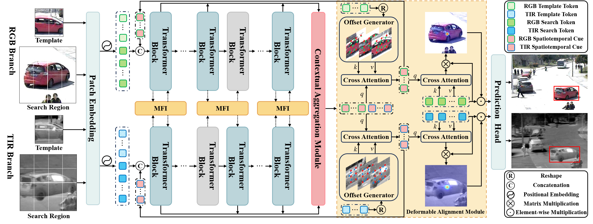

# 🎯 CADTrack: Contextual Aggregation with Deformable Alignment for Robust RGBT Tracking


> [CADTrack: Learning Contextual Aggregation with Deformable Alignment for Robust RGBT Tracking](https://arxiv.org/abs/2511.17967)  
> [Hao Li](https://orcid.org/0009-0009-2668-7908), [Yuhao Wang](https://924973292.github.io/), [Xiantao Hu](https://xiantaohu.github.io/index.html), [Wenning Hao*](https://orcid.org/0000-0002-1526-7889), [Pingping Zhang*](https://scholar.google.com/citations?user=MfbIbuEAAAAJ&hl=zh-CN), [Dong Wang](https://scholar.google.com/citations?user=nVgPQpoAAAAJ&hl=zh-CN), [Huchuan Lu](https://scholar.google.com/citations?user=D3nE0agAAAAJ&hl=zh-CN)
> [**AAAI 2026**](https://arxiv.org/pdf/2511.17967)

This repository contains the official implementation of [**CADTrack**](https://arxiv.org/pdf/2511.17967), a novel framework for robust RGB-Thermal (RGBT) object tracking. CADTrack addresses key challenges of modality discrepancies and spatial misalignment via three innovative components: **Mamba-based Feature Interaction (MFI)** for efficient cross-modal interaction, **Contextual Aggregation Module (CAM)** for dynamic multi-layer feature fusion, and **Deformable Alignment Module (DAM)** for spatiotemporal alignment. Included are training/evaluation [codes](https://github.com/IdolLab/CADTrack), [pre-trained models](https://pan.baidu.com/s/1GhiRfekS90EFsEePTHbzYg?pwd=3mbq), and [raw results](https://pan.baidu.com/s/1GhiRfekS90EFsEePTHbzYg?pwd=3mbq).

## 🚀 New
- 🎉 Paper Accepted at AAAI 2026!
- 📦 Code & Models Released – Full implementation now publicly available.
  
## ✨ Key Features & Contributions
<p align="center">
  <p align="center">
    
  <p align="center">
<p align="center" style="font-size: 18px; color: gray;">
    Figure 1: Overall framework of CADTrack.
</p>
<p align="center">
    
</p>
<p align="center" style="font-size: 18px; color: gray;">
    Figure 2: Details of MFI.
</p>
<p align="center">
    
</p>
<p align="center" style="font-size: 18px; color: gray;">
    Figure 3: The structure of CAM.
</p>
<p align="center">
    
</p>
<p align="center" style="font-size: 18px; color: gray;">
    Figure 4: Deformable alignment of DAM.
</p>

## ⚙️ Installation
Create and activate a conda environment:
```
conda create -n CADTrack python=3.10
conda activate CADTrack
```
Install the required packages:
```
bash install_cadtrack.sh
```

## 📂 Data Preparation
Download the following datasets and place them under ./data/:
- [GTOT, RGBT210, RGBT234, LasHeR](https://chenglongli.cn/Datasets-and-benchmark-code/)
- [VTUAV](https://zhang-pengyu.github.io/DUT-VTUAV/)
```
$<PATH_of_CADTrack>
-- data
    -- GTOT
        |-- BlackCar
        |-- Black5wan1
        ...
    -- RGBT210
        |-- afterrain
        |-- aftertree
        ...
    -- RGBT234
        |-- afterrain
        |-- aftertree
        ...
    -- LasHeR/train
        |-- 1boygo
        |-- 1handsth
        ...
    -- LasHeR/test
        |-- 1blackteacher
        |-- 1boycoming
        ...
    -- VTUAV/train
        |-- animal_002
        |-- bike_002
        ...
    -- VTUAV/test_ST
        |-- animal_001
        |-- bike_003
        ...
    -- VTUAV/test_LT
        |-- animal_003
        |-- animal_004
        ...
```

## 🔧 Setup & Configuration
Run the following command to set paths:
```
cd <PATH_of_CADTrack>
python tracking/create_default_local_file.py --workspace_dir . --data_dir ./data --save_dir ./output
```
You can also modify paths by these two files:
```
./lib/train/admin/local.py  # paths for training
./lib/test/evaluation/local.py  # paths for testing
```

## 🏋️ Training
Dowmload the pretrained [foundation model](https://pan.baidu.com/s/15GjTLQboXcfJaTD5sLLRDQ?pwd=hmaa) (Baidu Driver:hmaa) 
and put it under ./pretrained/.
```
bash train.sh
```
You can train models with various modalities and variants by modifying ```train.sh```.

## 📊 Testing
### Testing on Benchmark Datasets
Modify the <DATASET_PATH> and <SAVE_PATH> in```./RGBT_workspace/test_rgbt_mgpus.py```, then run:
```
bash test.sh
```
### Evaluation Tools
- GTOT/RGBT210/RGBT234/LasHeR: Use the [Evaluation Toolkit](https://chenglongli.cn/Datasets-and-benchmark-code/)
- VTUAV: Follow the [VTUAV_Evaluation](https://zhang-pengyu.github.io/DUT-VTUAV/)

## 📜 Poster
<p align="center">
    
</p>

## 📝 Citation
If you find CADTrack is helpful for your research, please consider citing:

```bibtex
@inproceedings{li2026cadtrack,
  title={CADTrack: Learning Contextual Aggregation with Deformable Alignment for Robust RGBT Tracking},
  author={Li, Hao and Wang, Yuhao and Hu, Xiantao and Hao, Wenning and Zhang, Pingping and Wang, Dong and Lu, Huchuan},
  booktitle={Proceedings of the AAAI Conference on Artificial Intelligence},
  volume={40},
  year={2026}
}
```

## 🙏 Acknowledgments
- This repo is based on [STTrack](https://github.com/NJU-PCALab/STTrack) and [IDEA](https://github.com/924973292/IDEA) which are excellent works.
- We thank for the [PyTracking](https://github.com/visionml/pytracking) library, which helps us to quickly implement our ideas.
